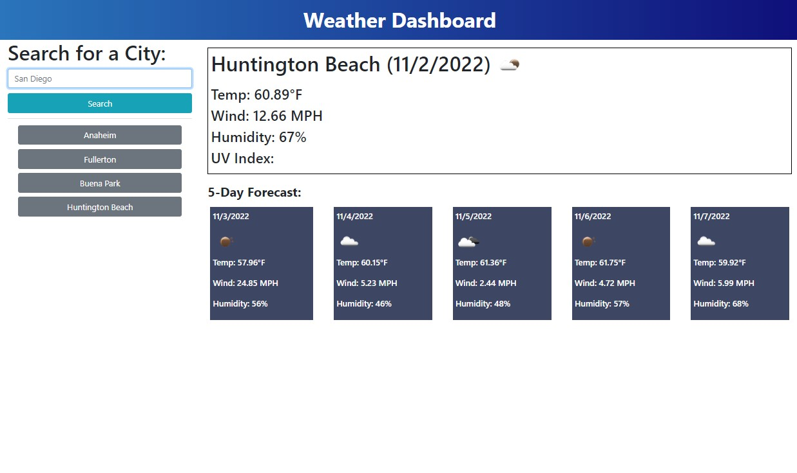

# **Upcoming Weather Dashboard**

## **Description**
I created this app as a way to help a traveler better plan a trip based on weather outlook for their desired cities and as practice using server-side APIs. Although no starter code was given, the HTML was pretty simple to set up as most of the content is served up using JavaScript. Due to implementing the Bootstrap framework, not much custom CSS was needed. 

**Note: There was an [issue](/README.md/#issue) with the OpenWeather One Call API 2.5 where some features have been deprecated for new API keys.**

Due to issues mentioned in the note above, I decided to use OpenWeather’s Current Weather Data API and 5 Day / 3 Hour Forecast API for the daily and five day forecast calls. Once the API call functions were provided with the corresponding URL including user inputted city, I coded the data to populate in the appropriate fields. Daily weather fields were hardcoded to the HTML and the data was simply passed through to each element. The five day forecast, however, required a for-loop in order to display weather information for each day. 

The Forecast API call returns several timestamps for each day so I had the data populate only for the 12:00:00 timestamp. In order to display the date in the desired format, I researched how to write a function to convert the timestamp information into MM/DD/YYYY format. 

Once the user submits a new city to search, that search is added to the city history where the user may click on it to get that city’s information once more. This was accomplished by setting values to and getting those values from a string in local storage. Finally, the parameters for certain colors based on UV Index conditions were set for the UV Index badge. 

#
## **Issue**
The [One Call API 2.5](https://openweathermap.org/api/one-call-api) provided for this assignment has been deprecated for new accounts/API Keys. I continued getting a 401 error no matter what parameters I changed in the API call URL, I even created a second API Key but neither worked. After some research I found this [issue on GitHub](https://github.com/openhab/openhab-addons/issues/13314) that explains what happened. While the instructional staff attempted to help me on this issue, I am assuming they were all using older accounts/API Keys which would explain why my code worked with their API Key but not mine. I decided to use other APIs provided by OpenWeather to get my API calls to work and provide me with all of the data I needed, except for the UV Index. UV Index information is currently only being provided through One Call API 3.0 which is a paid subscription service that I do not have access to as a student. 

I am confident that the code I wrote works if given a valid API Key, however at the time of completing this assignment I have no way of knowing for certain as I do not have an older account/API Key available to me for testing. 

#
## **Usage**
To view the website application please click [HERE](
https://emmasiren.github.io/upcoming-weather-dashboard/).

The following image shows the web application when loaded correctly.
